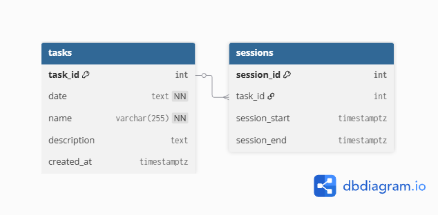

# Task Tracking Application

This **Task Tracking App** is a full-stack web application built with the **PERN stack** (PostgreSQL, Express, React, Node.js). The app allows users to **create, read, update, and delete (CRUD)** tasks to manage and time daily activities.

The backend is implemented as a *RESTful API* using **Express** and connected to a PostgreSQL database hosted on **Neon**. The frontend is built with **React** and styled with **tailwindcss**.

### Database Schema:

## Tools Used For This Project:

   &nbsp
   &nbsp
   &nbsp
   &nbsp
   &nbsp
   &nbsp
   &nbsp
   &nbsp
  

## Acknowledgements:
- [Neon](https://neon.com/) - Hosts PostgreSQL database
- [Mantine](https://mantine.dev/dates/date-time-picker/) - Calendar component in Task Tracking Application
- [heroicons](https://heroicons.com/outline) - Provided icons used in Task Tracking Application
- [dbdiagram.io](https://dbdiagram.io/home) - Create database schema diagram for README.md
- [Devicon](https://devicon.dev/) - Provided icons for this README.md
